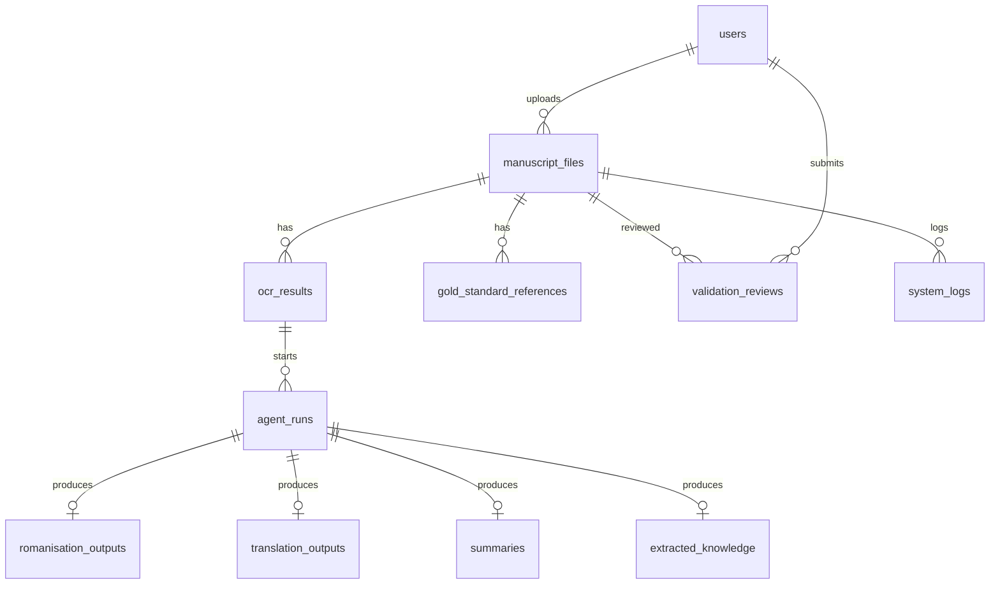

# Database Schema

## Overview

**Project title:** Multi-Agent Framework for Classical Malay Understanding and Knowledge Extraction

The prototype uses Supabase for database records and file storage. The schema is intentionally simple for FYP implementation and demonstration.

## Mermaid ERD



## Common Status Values

| Status | Meaning |
| --- | --- |
| `pending` | Created but not started. |
| `running` | Currently processing. |
| `completed` | Finished successfully. |
| `needs_review` | Output requires human validation. |
| `failed` | Processing failed. |
| `failed_external_api` | External provider unavailable or failed. |

## users

**Purpose:** Stores prototype users such as student, supervisor, or reviewer.

| Field | Type | Key | Constraints |
| --- | --- | --- | --- |
| id | uuid | PK | Default generated UUID. |
| email | text | Unique | Required. |
| full_name | text |  | Required. |
| role | text |  | Values: `student`, `supervisor`, `reviewer`, `admin`. |
| created_at | timestamptz |  | Default now. |

**Sample record**

```json
{
  "id": "11111111-1111-1111-1111-111111111111",
  "email": "reviewer@example.com",
  "full_name": "FYP Reviewer",
  "role": "reviewer",
  "created_at": "2026-05-25T10:00:00Z"
}
```

## manuscript_files

**Purpose:** Stores uploaded manuscript/document metadata.

| Field | Type | Key | Constraints |
| --- | --- | --- | --- |
| id | uuid | PK | Default generated UUID. |
| user_id | uuid | FK | References `users.id`. |
| title | text |  | Required. |
| source_collection | text |  | Example: `Majalah Qalam`. |
| year | integer |  | Nullable, expected 1950-1969 for project scope. |
| file_name | text |  | Required. |
| file_type | text |  | Values: `pdf`, `image`. |
| storage_path | text |  | Required. |
| status | text |  | Common status value. |
| created_at | timestamptz |  | Default now. |

**Sample record**

```json
{
  "id": "22222222-2222-2222-2222-222222222222",
  "user_id": "11111111-1111-1111-1111-111111111111",
  "title": "Majalah Qalam sample excerpt",
  "source_collection": "Majalah Qalam",
  "year": 1955,
  "file_name": "qalam_sample.pdf",
  "file_type": "pdf",
  "storage_path": "manuscripts/qalam_sample.pdf",
  "status": "pending",
  "created_at": "2026-05-25T10:05:00Z"
}
```

## ocr_results

**Purpose:** Stores OCR output, confidence, accuracy, and CER.

| Field | Type | Key | Constraints |
| --- | --- | --- | --- |
| id | uuid | PK | Default generated UUID. |
| manuscript_file_id | uuid | FK | References `manuscript_files.id`. |
| provider | text |  | Example: `fine_tuned`, `tesseract`, `vlm`. |
| original_ocr_text | text |  | Required, never silently overwritten. |
| confidence_score | numeric |  | Nullable, range 0-1 if available. |
| character_accuracy | numeric |  | Nullable, range 0-1. |
| cer | numeric |  | Nullable, range 0-1 or higher for severe errors. |
| status | text |  | Common status value. |
| metadata | jsonb |  | Preprocessing/model information. |
| created_at | timestamptz |  | Default now. |

**Sample record**

```json
{
  "id": "33333333-3333-3333-3333-333333333333",
  "manuscript_file_id": "22222222-2222-2222-2222-222222222222",
  "provider": "fine_tuned",
  "original_ocr_text": "نمونه جاوي...",
  "confidence_score": 0.67,
  "character_accuracy": 0.62,
  "cer": 0.38,
  "status": "completed",
  "metadata": {"model_version": "jawi-ocr-fyp-v1"},
  "created_at": "2026-05-25T10:08:00Z"
}
```

## agent_runs

**Purpose:** Tracks each agent execution.

| Field | Type | Key | Constraints |
| --- | --- | --- | --- |
| id | uuid | PK | Default generated UUID. |
| ocr_result_id | uuid | FK | References `ocr_results.id`. |
| agent_name | text |  | Required. |
| input_text | text |  | Required. |
| output_text | text |  | Nullable for JSON-only output. |
| status | text |  | Common status value. |
| confidence_score | numeric |  | Nullable, range 0-1 if available. |
| error_message | text |  | Nullable. |
| retry_count | integer |  | Default 0. |
| created_at | timestamptz |  | Default now. |
| completed_at | timestamptz |  | Nullable. |

**Sample record**

```json
{
  "id": "44444444-4444-4444-4444-444444444444",
  "ocr_result_id": "33333333-3333-3333-3333-333333333333",
  "agent_name": "Romanisation Agent",
  "input_text": "Original OCR Jawi text...",
  "output_text": "Romanised text...",
  "status": "completed",
  "confidence_score": 0.7,
  "error_message": null,
  "retry_count": 0
}
```

## romanisation_outputs

**Purpose:** Stores romanised Malay output.

| Field | Type | Key | Constraints |
| --- | --- | --- | --- |
| id | uuid | PK | Default generated UUID. |
| agent_run_id | uuid | FK | References `agent_runs.id`. |
| romanised_text | text |  | Required. |
| uncertain_tokens | jsonb |  | Nullable list. |
| notes | text |  | Nullable. |
| created_at | timestamptz |  | Default now. |

**Sample record**

```json
{
  "id": "55555555-5555-5555-5555-555555555555",
  "agent_run_id": "44444444-4444-4444-4444-444444444444",
  "romanised_text": "Ini contoh teks rumi...",
  "uncertain_tokens": ["perkataan?"],
  "notes": "Some words require review."
}
```

## translation_outputs

**Purpose:** Stores modern Malay translation.

| Field | Type | Key | Constraints |
| --- | --- | --- | --- |
| id | uuid | PK | Default generated UUID. |
| agent_run_id | uuid | FK | References `agent_runs.id`. |
| translated_text | text |  | Required. |
| source_language | text |  | Default `Classical Malay/Jawi`. |
| target_language | text |  | Default `Modern Malay`. |
| uncertainty_notes | text |  | Nullable. |
| created_at | timestamptz |  | Default now. |

**Sample record**

```json
{
  "id": "66666666-6666-6666-6666-666666666666",
  "agent_run_id": "44444444-4444-4444-4444-444444444444",
  "translated_text": "Ini ialah contoh terjemahan moden...",
  "source_language": "Classical Malay/Jawi",
  "target_language": "Modern Malay",
  "uncertainty_notes": "One sentence is uncertain due to OCR noise."
}
```

## summaries

**Purpose:** Stores document summaries.

| Field | Type | Key | Constraints |
| --- | --- | --- | --- |
| id | uuid | PK | Default generated UUID. |
| agent_run_id | uuid | FK | References `agent_runs.id`. |
| summary_text | text |  | Required. |
| key_points | jsonb |  | Nullable list. |
| created_at | timestamptz |  | Default now. |

**Sample record**

```json
{
  "id": "77777777-7777-7777-7777-777777777777",
  "agent_run_id": "44444444-4444-4444-4444-444444444444",
  "summary_text": "Petikan ini membincangkan isu masyarakat.",
  "key_points": ["isu masyarakat", "nasihat", "konteks sejarah"]
}
```

## extracted_knowledge

**Purpose:** Stores structured knowledge extraction output.

| Field | Type | Key | Constraints |
| --- | --- | --- | --- |
| id | uuid | PK | Default generated UUID. |
| agent_run_id | uuid | FK | References `agent_runs.id`. |
| entities | jsonb |  | Default empty list. |
| dates | jsonb |  | Default empty list. |
| places | jsonb |  | Default empty list. |
| topics | jsonb |  | Default empty list. |
| relationships | jsonb |  | Default empty list. |
| confidence_score | numeric |  | Nullable, range 0-1. |
| created_at | timestamptz |  | Default now. |

**Sample record**

```json
{
  "id": "88888888-8888-8888-8888-888888888888",
  "agent_run_id": "44444444-4444-4444-4444-444444444444",
  "entities": [{"text": "Majalah Qalam", "type": "publication"}],
  "dates": [{"text": "1955", "normalized": "1955"}],
  "places": [],
  "topics": ["pendidikan", "masyarakat"],
  "relationships": [],
  "confidence_score": 0.65
}
```

## validation_reviews

**Purpose:** Stores human validation and corrections.

| Field | Type | Key | Constraints |
| --- | --- | --- | --- |
| id | uuid | PK | Default generated UUID. |
| manuscript_file_id | uuid | FK | References `manuscript_files.id`. |
| reviewer_id | uuid | FK | References `users.id`. |
| review_target | text |  | Example: `ocr`, `romanisation`, `translation`, `summary`, `knowledge`. |
| rating | integer |  | Nullable, suggested 1-5. |
| correction_text | text |  | Nullable. |
| comments | text |  | Nullable. |
| status | text |  | Values: `approved`, `needs_revision`, `rejected`. |
| created_at | timestamptz |  | Default now. |

**Sample record**

```json
{
  "id": "99999999-9999-9999-9999-999999999999",
  "manuscript_file_id": "22222222-2222-2222-2222-222222222222",
  "reviewer_id": "11111111-1111-1111-1111-111111111111",
  "review_target": "translation",
  "rating": 4,
  "correction_text": "Corrected translation text...",
  "comments": "Mostly accurate, one phrase corrected.",
  "status": "approved"
}
```

## gold_standard_references

**Purpose:** Stores manually verified references used for evaluation.

| Field | Type | Key | Constraints |
| --- | --- | --- | --- |
| id | uuid | PK | Default generated UUID. |
| manuscript_file_id | uuid | FK | References `manuscript_files.id`. |
| reference_type | text |  | `ocr`, `romanisation`, `translation`, `summary`, `knowledge`. |
| reference_text | text |  | Nullable for JSON-only references. |
| reference_json | jsonb |  | Nullable. |
| prepared_by | text |  | Nullable. |
| approved_by | text |  | Nullable. |
| created_at | timestamptz |  | Default now. |

**Sample record**

```json
{
  "id": "aaaaaaaa-aaaa-aaaa-aaaa-aaaaaaaaaaaa",
  "manuscript_file_id": "22222222-2222-2222-2222-222222222222",
  "reference_type": "ocr",
  "reference_text": "Manual Jawi transcription...",
  "reference_json": null,
  "prepared_by": "Student",
  "approved_by": "Supervisor"
}
```

## system_logs

**Purpose:** Stores audit and debugging logs.

| Field | Type | Key | Constraints |
| --- | --- | --- | --- |
| id | uuid | PK | Default generated UUID. |
| manuscript_file_id | uuid | FK | Nullable, references `manuscript_files.id`. |
| event_type | text |  | Required. |
| message | text |  | Required. |
| details | jsonb |  | Nullable. |
| severity | text |  | Values: `info`, `warning`, `error`. |
| created_at | timestamptz |  | Default now. |

**Sample record**

```json
{
  "id": "bbbbbbbb-bbbb-bbbb-bbbb-bbbbbbbbbbbb",
  "manuscript_file_id": "22222222-2222-2222-2222-222222222222",
  "event_type": "agent_retry",
  "message": "Knowledge Extraction Agent returned invalid JSON; retry started.",
  "details": {"agent_name": "Knowledge Extraction Agent", "retry_count": 1},
  "severity": "warning"
}
```
