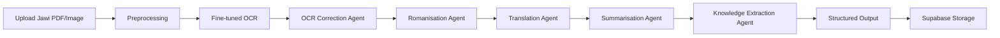

# Multi-Agent Framework for Classical Malay Understanding and Knowledge Extraction

## Short Description

This Final Year Project prototype processes selected scanned Jawi documents from Majalah Qalam, especially scanned image/PDF material from 1950-1969. The project improves Jawi OCR using manually prepared ground-truth data and then applies a multi-agent pipeline to produce romanisation, modern Malay translation, summary, and structured knowledge extraction.

## Problem Summary

Generic OCR tools perform poorly on Classical Malay Jawi documents because of scan quality, typography variation, Arabic-based characters, and Malay-specific Jawi letters. Weak OCR output causes downstream NLP agents to produce unreliable romanisation, translation, summaries, and extracted knowledge. The system therefore treats OCR improvement as the first major requirement before higher-level language understanding.

## System Features

| Feature | Description |
| --- | --- |
| Document upload | Accepts selected scanned Jawi image/PDF documents. |
| Preprocessing | Validates file type and prepares image/PDF pages for OCR. |
| Fine-tuned OCR | Extracts Jawi text using a custom OCR model trained with manual ground truth. |
| OCR benchmarking | Compares fine-tuned OCR against Tesseract and VLM-based OCR using accuracy and CER. |
| Multi-agent processing | Runs OCR correction, romanisation, translation, summarisation, and knowledge extraction. |
| Structured output | Displays and stores OCR text, romanised text, modern Malay translation, summary, entities, topics, and notes. |
| Human validation | Allows reviewer corrections against gold-standard references. |

## Multi-Agent Workflow



## Tech Stack

| Layer | Technology |
| --- | --- |
| Frontend | React |
| Backend | Python, FastAPI |
| OCR training and experiments | Python, Google Colab, PyTorch, OpenCV, PyMuPDF |
| Agent framework | LangChain |
| LLM access | OpenRouter or configured LLM APIs |
| Database and storage | Supabase |
| Deployment | Local prototype first, optional Docker later |

## Folder Structure

```text
project-root/
  backend/                 # Planned FastAPI backend
  frontend/                # Planned React frontend
  data/                    # Local development inputs/outputs
  notebooks/               # OCR training and experiment notebooks
  tests/                   # Unit, integration, and failure-case tests
  docs/                    # FYP documentation set
```

## Setup Guide

1. Create a Python virtual environment for the backend.
2. Install backend dependencies such as FastAPI, Uvicorn, OCR libraries, LangChain, and Supabase client.
3. Configure `.env` using the variables listed in [DEPLOYMENT.md](DEPLOYMENT.md).
4. Set up the React frontend.
5. Configure Supabase tables using [DATABASE_SCHEMA.md](DATABASE_SCHEMA.md).
6. Prepare a small pilot dataset with manually verified gold-standard text.

## Run Commands

```bash
# Backend
cd backend
uvicorn main:app --reload

# Frontend
cd frontend
npm install
npm run dev

# Tests
pytest
```

The current repository also contains an earlier lightweight Python pipeline. For the final prototype, the target architecture is the React + FastAPI + Supabase pipeline documented here.

## Documentation Links

| Document | Purpose |
| --- | --- |
| [PRD.md](PRD.md) | Product requirements, scope, metrics, and assumptions. |
| [SAD.md](SAD.md) | System architecture and agent failure handling. |
| [AGENTS.md](AGENTS.md) | Rules for Codex and AI coding agents. |
| [CLAUDE.md](CLAUDE.md) | Rules for Claude Code. |
| [DATABASE_SCHEMA.md](DATABASE_SCHEMA.md) | Supabase table design. |
| [API_SPEC.md](API_SPEC.md) | Backend API routes and examples. |
| [QATD.md](QATD.md) | QA plan and test cases. |
| [TASKS.md](TASKS.md) | Implementation task breakdown. |
| [DEPLOYMENT.md](DEPLOYMENT.md) | Local deployment and demo checklist. |

## Testing Guide

Testing should cover:

- OCR output and CER calculation.
- OCR benchmarking against Tesseract and VLM-based OCR.
- Agent output format and confidence/uncertainty fields.
- API endpoint validation.
- Supabase record creation.
- Failure cases such as invalid JSON, failed LLM/API calls, unreadable scans, and low OCR confidence.

## Demo Guide

For the FYP demo:

1. Upload a clear scanned Jawi sample.
2. Show preprocessing and OCR output.
3. Show OCR benchmark result and CER.
4. Run the full agent pipeline.
5. Display original OCR text, corrected OCR text, romanisation, translation, summary, and extracted knowledge.
6. Submit a human validation review.
7. Show stored records in Supabase.

## Prototype Limitations

- The final dataset size is still subject to supervisor or library collaborator confirmation.
- The prototype targets selected Majalah Qalam samples, not all Jawi archives.
- OCR performance may vary strongly by scan quality and typography.
- LLM outputs require validation because OCR errors can cause hallucination or mistranslation.
- The system is a local FYP prototype, not a production digital archive.

## Future Work

- Expand dataset coverage after supervisor approval.
- Improve OCR model accuracy beyond the 60% target.
- Add better Jawi-specific language model constraints.
- Add a richer human review interface.
- Add Docker deployment if required for demonstration.
