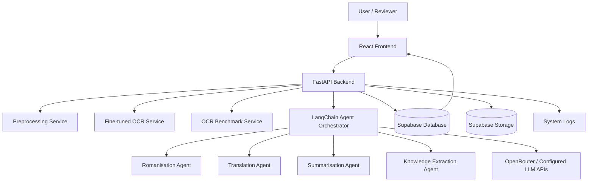
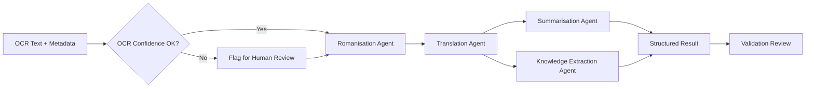
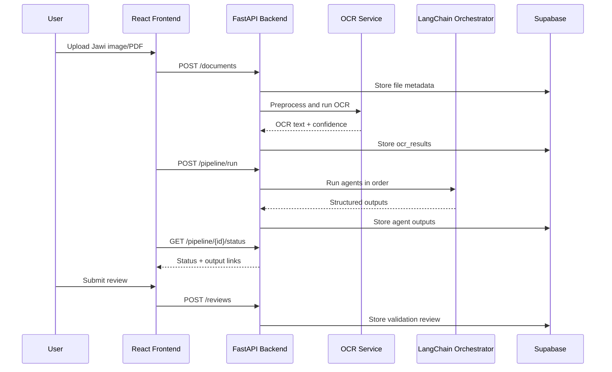

# System Architecture Document

## System Overview

**Project title:** Multi-Agent Framework for Classical Malay Understanding and Knowledge Extraction

The system is a local FYP prototype that accepts selected scanned Majalah Qalam Jawi image/PDF documents, preprocesses them, runs fine-tuned OCR, evaluates OCR quality, and then coordinates specialised agents for romanisation, modern Malay translation, summarisation, and structured knowledge extraction. Outputs and review records are stored in Supabase.

## System Architecture

## Module Breakdown

| Module | Responsibility |
| --- | --- |
| Document Upload Module | Accept scanned image/PDF, validate type and size, store uploaded file metadata. |
| Preprocessing Module | Convert PDF pages to images, clean image where appropriate, detect unreadable input. |
| OCR Module | Run fine-tuned Jawi OCR and store original OCR text, confidence, accuracy, and CER. |
| OCR Benchmarking Module | Compare fine-tuned OCR with Tesseract and VLM-based OCR on gold-standard samples. |
| Multi-Agent Processing Module | Coordinate romanisation, translation, summarisation, and extraction. |
| Output Module | Display structured output and preserve every stage result. |
| Review Module | Store human validation, corrections, and review status. |
| Storage Module | Store uploaded documents, outputs, references, reviews, and logs in Supabase. |

## Multi-Agent Pipeline

## Agent Roles

| Agent | Role |
| --- | --- |
| Romanisation Agent | Convert OCR Jawi text into romanised Classical Malay (Rumi). |
| Translation Agent | Translate Classical Malay/romanised text into modern Malay. |
| Summarisation Agent | Summarise the modern Malay translation. |
| Knowledge Extraction Agent | Extract structured entities, dates, places, topics, and relationships. |

## Agent Input/Output Table

| Agent | Input | Output | Stored In |
| --- | --- | --- | --- |
| Romanisation Agent | Original OCR Jawi text | Romanised text, uncertain tokens | `romanisation_outputs` |
| Translation Agent | Romanised text | Modern Malay translation, notes, confidence/uncertainty | `translation_outputs` |
| Summarisation Agent | Modern Malay translation | Summary, key points, confidence/uncertainty | `summaries` |
| Knowledge Extraction Agent | Translation, summary, optional source text | JSON with entities, dates, places, topics, relationships, confidence | `extracted_knowledge` |

## Model/Tool Used By Each Agent

| Component | Model/Tool | Notes |
| --- | --- | --- |
| OCR preprocessing | OpenCV, PyMuPDF | PDF/image handling and page preprocessing. |
| Fine-tuned OCR | PyTorch OCR model trained in Google Colab | Target at least 60% character accuracy. |
| OCR baseline | Tesseract | Used as benchmark baseline. |
| VLM OCR baseline | Configured VLM/API | Used where sample privacy and API settings permit. |
| Agent orchestration | LangChain | Coordinates steps, validation, retries, and output parsing. |
| Agent LLM | OpenRouter or configured LLM APIs | Must be configured via environment variables. |
| Storage | Supabase | Database and file storage. |

| Agent | Model/Tool | Output Control |
| --- | --- | --- |
| Romanisation Agent | LangChain prompt chain using configured LLM provider and Jawi romanisation instructions | Must return romanised text and uncertain tokens where possible. |
| Translation Agent | LangChain prompt chain using configured LLM provider | Must translate into modern Malay and avoid unsupported additions. |
| Summarisation Agent | LangChain prompt chain using configured LLM provider | Must summarise from the translation, not invent new facts. |
| Knowledge Extraction Agent | LangChain structured-output chain using configured LLM provider | Must return JSON with entities, dates, places, topics, relationships, and confidence. |

## Coordination Logic

1. Backend receives uploaded document and creates a `manuscript_files` record.
2. Preprocessing prepares the document for OCR.
3. OCR module generates original OCR text and stores it in `ocr_results`.
4. If a gold-standard reference exists, benchmark metrics are calculated.
5. Agent orchestrator creates one `agent_runs` record per agent stage.
6. Agents run in this order:
   - Romanisation Agent.
   - Translation Agent.
   - Summarisation Agent.
   - Knowledge Extraction Agent.
7. Each output is validated before moving to the next stage.
8. Invalid, incomplete, or contradictory outputs are retried or flagged for human review.
9. Final output is displayed in the frontend and stored in Supabase.

## OCR Error Propagation Explanation

OCR errors are the main upstream risk. A wrong Jawi character can change the romanised word. A wrong romanised word can change the translation. A wrong translation can create an inaccurate summary. A wrong summary or translation can cause false extracted entities, topics, dates, or relationships.

For this reason, the system:

- Stores original OCR text separately.
- Tracks confidence and CER.
- Marks low-confidence output for review.
- Allows human validation before using results as final evidence.

## Failure Handling

| Failure Case | System Response |
| --- | --- |
| OCR confidence is low | Store OCR output, mark status as `needs_review`, continue only if user allows, and show warning in frontend. |
| Manuscript image is unreadable | Stop OCR run, store failure in `system_logs`, return `422 UNPROCESSABLE_ENTITY`, and request clearer sample or manual transcription. |
| LLM/API response is incomplete | Retry with stricter prompt and shorter context; if still incomplete, store partial output with status `failed` or `needs_review`. |
| Agent output contradicts previous agent output | Run consistency check, flag contradiction, store both outputs, and require human review before final approval. |
| JSON output is invalid | Retry JSON repair once or twice; if still invalid, store raw output and mark agent run as `failed`. |
| External API is unavailable | Use configured fallback provider if allowed; otherwise mark run as `failed_external_api` and allow retry later. |

## Retry Strategy

| Step | Retry Rule |
| --- | --- |
| OCR preprocessing | Retry once with safer preprocessing settings. |
| OCR model inference | Retry once if runtime fails, not if input is unreadable. |
| LLM agent call | Retry up to 2 times with stricter output instruction. |
| JSON parsing | Retry up to 2 times with schema repair prompt. |
| Supabase write | Retry up to 3 times for temporary network errors. |

Retries must be logged in `system_logs` and linked to `agent_runs` where relevant.

## Fallback Strategy

| Failure | Fallback |
| --- | --- |
| Fine-tuned OCR unavailable | Use Tesseract or VLM baseline only if configured, and mark output as baseline. |
| Low OCR confidence | Send result to human review before trusting downstream output. |
| LLM provider unavailable | Use fallback provider configured in environment variables, or pause the run. |
| Knowledge extraction JSON invalid | Store raw text and require reviewer correction. |
| Gold-standard reference missing | Run pipeline but mark evaluation metrics as unavailable. |

## Human Review Workflow

1. Reviewer opens a processed document.
2. Reviewer compares original scan, OCR text, romanisation, translation, summary, and extracted knowledge.
3. Reviewer submits corrections or approval.
4. Review is stored in `validation_reviews`.
5. If approved, output can be used for final prototype evaluation.

## Frontend/Backend/Database Interaction

## Panel Monitoring Coverage

This SAD directly addresses the requested clearer agent details:

- Agent roles and input/output are defined.
- Model/tool choices are stated.
- Coordination logic is described.
- OCR error propagation is explained.
- Failure handling, retry, fallback, and human review workflows are included.
- Agent failure cases such as invalid JSON, contradiction, and API outage are explicitly handled.
