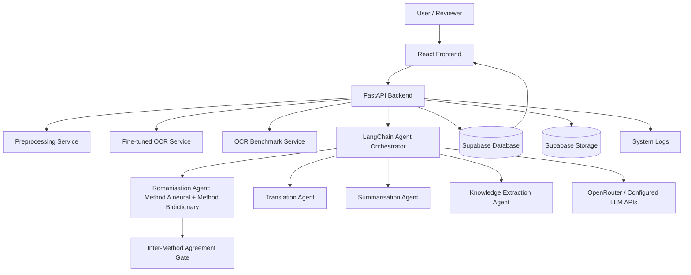
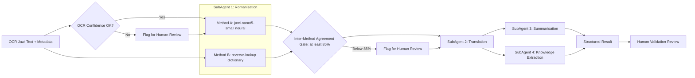
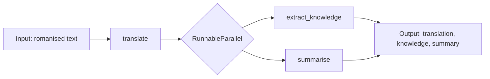
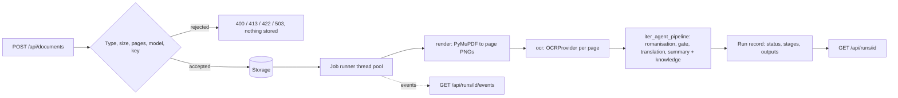
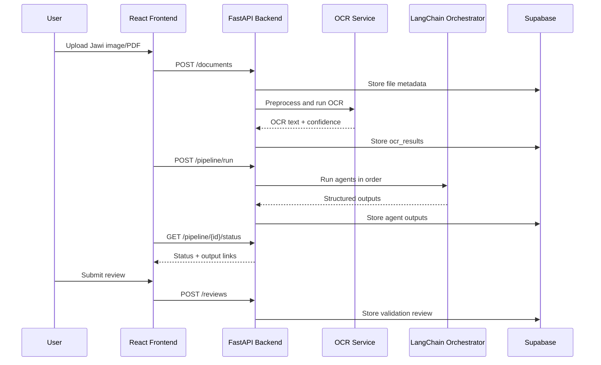

# System Architecture Document

## System Overview

**Project title:** Multi-Agent Framework for Classical Malay Understanding and Knowledge Extraction

The system is a local FYP prototype that accepts selected scanned Majalah Qalam Jawi image/PDF documents, preprocesses them, runs fine-tuned OCR, evaluates OCR quality, and then coordinates specialised agents for romanisation, modern Malay translation, summarisation, and structured knowledge extraction. Outputs and review records are stored in Supabase.

## System Architecture


```mermaid
flowchart TB
    U[User / Reviewer] --> FE[React Frontend]
    FE --> API[FastAPI Backend]
    API --> PRE[Preprocessing Service]
    API --> OCR[Fine-tuned OCR Service]
    API --> BENCH[OCR Benchmark Service]
    API --> ORCH[LangChain Agent Orchestrator]
    ORCH --> A1[Romanisation Agent: Method A neural + Method B dictionary]
    A1 --> GATE[Inter-Method Agreement Gate]
    ORCH --> A2[Translation Agent]
    ORCH --> A3[Summarisation Agent]
    ORCH --> A4[Knowledge Extraction Agent]
    ORCH --> LLM[OpenRouter / Configured LLM APIs]
    API --> DB[(Supabase Database)]
    API --> ST[(Supabase Storage)]
    API --> LOG[System Logs]
    DB --> FE
```

## Module Breakdown

| Module | Responsibility |
| --- | --- |
| Document Upload Module | Accept scanned image/PDF, validate type and size, store uploaded file metadata. |
| Preprocessing Module | Convert PDF pages to images, clean image where appropriate, detect unreadable input. |
| OCR Module | Run fine-tuned Jawi OCR and store original OCR text, confidence, accuracy, and CER. |
| OCR Benchmarking Module | Compare fine-tuned OCR with Tesseract and VLM-based OCR on gold-standard samples. |
| Multi-Agent Processing Module | Coordinate romanisation, translation, summarisation, and extraction. |
| Output Module | Display structured output and preserve every stage result. |
| Review Module | Store human validation, corrections, and review status. |
| Storage Module | Store uploaded documents, outputs, references, reviews, and logs in Supabase. |

## Multi-Agent Pipeline


```mermaid
flowchart LR
    A[OCR Jawi Text + Metadata] --> B{OCR Confidence OK?}
    B -- No --> C[Flag for Human Review]
    B -- Yes --> RA
    C --> RA
    subgraph S1[SubAgent 1: Romanisation]
        RA[Method A: jawi-nanot5-small neural]
        RB[Method B: reverse-lookup dictionary]
    end
    A --> RB
    RA --> GATE{Inter-Method Agreement Gate: at least 85%}
    RB --> GATE
    GATE -- Below 85% --> R[Flag for Human Review]
    GATE --> F[SubAgent 2: Translation]
    R --> F
    F --> G[SubAgent 3: Summarisation]
    F --> H[SubAgent 4: Knowledge Extraction]
    G --> I[Structured Result]
    H --> I
    I --> J[Human Validation Review]
```

Method A and Method B run in parallel on the same OCR text. Translation must finish before Summarisation and Knowledge Extraction start, because both consume the modern Malay translation. Summarisation and Knowledge Extraction do not depend on each other and run concurrently. Every stage is wrapped by the Runtime Fault Handler.

## Agent Roles

| Agent | Role |
| --- | --- |
| Romanisation Agent (SubAgent 1) | Convert OCR Jawi text into romanised Classical Malay (Rumi) using two independent methods (A: neural, B: dictionary) and check their agreement. |
| Translation Agent | Translate Classical Malay/romanised text into modern Malay. |
| Summarisation Agent | Summarise the modern Malay translation. |
| Knowledge Extraction Agent | Extract structured entities, dates, places, topics, and relationships. |

## Agent Input/Output Table

| Agent | Input | Output | Stored In |
| --- | --- | --- | --- |
| Romanisation Agent | Original OCR Jawi text | Method A text (primary), Method B text, ambiguous/unknown word log, agreement score | `romanisation_outputs` |
| Translation Agent | Romanised text | Modern Malay translation, notes, confidence/uncertainty | `translation_outputs` |
| Summarisation Agent | Modern Malay translation | Summary, key points, confidence/uncertainty | `summaries` |
| Knowledge Extraction Agent | Translation, summary, optional source text | JSON with entities, dates, places, topics, relationships, confidence | `extracted_knowledge` |

## Model/Tool Used By Each Agent

| Component | Model/Tool | Notes |
| --- | --- | --- |
| OCR preprocessing | OpenCV, PyMuPDF | PDF/image handling and page preprocessing. |
| Fine-tuned OCR | PyTorch OCR model trained in Google Colab | Target CER at most 10% and character accuracy at least 90%. |
| Romanisation Method A | `mesolitica/jawi-nanot5-small-malaysian-cased` via `transformers`, run locally | Pretrained model used as-is (no fine-tuning). Reported chrF2++ 98.01 Jawi to Rumi on modern Jawi. |
| Romanisation Method B | Reverse-lookup dictionary built from `mesolitica/jawi-ms-en` (`wikipedia-1word.json` + `rumi-set.json`/`jawi-set.json` train split) | Rule-based. Retries pre-1986 spelling variants, splits joined prefixes, and flags ambiguous/unknown words. |
| OCR baseline | Tesseract | Used as benchmark baseline. |
| VLM OCR baseline | Configured VLM/API | Used where sample privacy and API settings permit. |
| Agent orchestration | LangChain (`langchain-core` runnables) | Translation, Summarisation and Knowledge Extraction are one runnable chain, with `RunnableParallel` for the concurrent pair. Retries stay in the Runtime Fault Handler. Validation and output parsing stay in the agents. |
| Agent LLM | OpenRouter, called through LangChain `ChatOpenAI` (`langchain-openai`) | `ChatOpenAI` is pointed at the OpenRouter base URL. Key and model are configured via environment variables. |
| Storage | Supabase | Database and file storage. |

| Agent | Model/Tool | Output Control |
| --- | --- | --- |
| Romanisation Agent | Method A neural model + Method B dictionary (no LLM) | Must return both readings, the agreement score, and the ambiguous/unknown word log. |
| Translation Agent | LangChain `ChatOpenAI` call to the configured OpenRouter model | Must translate into modern Malay and avoid unsupported additions. |
| Summarisation Agent | LangChain `ChatOpenAI` call to the configured OpenRouter model | Must summarise from the translation, not invent new facts. |
| Knowledge Extraction Agent | LangChain `ChatOpenAI` call to the configured OpenRouter model. The JSON is validated by the agent itself, with one repair call. | Must return JSON with entities, dates, places, topics, relationships, and confidence. |

## Coordination Logic

1. Backend receives uploaded document and creates a `manuscript_files` record.
2. Preprocessing prepares the document for OCR.
3. OCR module generates original OCR text and stores it in `ocr_results`.
4. If a gold-standard reference exists, benchmark metrics are calculated.
5. Agent orchestrator creates one `agent_runs` record per agent stage.
6. Agents run in this order:
   - Romanisation Agent: Method A and Method B in parallel.
   - Inter-Method Agreement Gate: compares A and B; below 85% flags the item for human review.
   - Translation Agent: consumes Method A output (or the fallback, see below).
   - Summarisation Agent and Knowledge Extraction Agent concurrently, both on the translation.
7. The Runtime Fault Handler wraps every stage: on exception, timeout, or empty output it logs the incident, passes the last valid output through, and marks the stage incomplete. The three LLM stages (Translation, Summarisation, Knowledge Extraction) are retried up to 2 times before that happens. See "Runtime Fault Handler Behaviour" below.
8. Flagged or incomplete items are shown to the user and require human review before being used as final evidence.

The same stage order is implemented once in `pipeline_runner.iter_agent_pipeline` and reused by the CLI runner, the FastAPI streaming endpoint, and the upload job runner.

## LangChain Orchestration

Implemented in `pipeline_runner.build_llm_chain` and `llm_text_runtime.LLMTextRuntime`.

**What uses LangChain.** The three LLM stages. Romanisation (Method A and Method B) and the Inter-Method Agreement Gate are plain Python and run before the chain, because they make no LLM call.

**The chain.** Translation, then Summarisation and Knowledge Extraction concurrently, is one LangChain runnable:

```python
RunnablePassthrough.assign(translation=RunnableLambda(translate))
    | RunnableAssign(RunnableParallel(knowledge=..., summary=...))
```


```mermaid
flowchart LR
    IN[Input: romanised text] --> T[translate]
    T --> P{RunnableParallel}
    P --> K[extract_knowledge]
    P --> S[summarise]
    K --> OUT[Output: translation, knowledge, summary]
    S --> OUT
```

- The input is `{"romanised": text}`. Each step adds one key that holds the `StageOutcome` of its stage.
- Each step is a `RunnableLambda` that calls `fault_handler.run_stage` with the stage function, its fallback and its retry settings. A step therefore never raises. A failed stage passes its fallback down the chain and is marked incomplete.
- When the orchestrator skips the summary for a short text, the `RunnableParallel` holds only the knowledge step.
- `iter_agent_pipeline` consumes the chain with `chain.stream()`. The translation result arrives as soon as it is ready, and the two concurrent results arrive in the order they finish. Each one becomes an `agent_done` event, so the event stream is the same as before LangChain was introduced.

**The LLM call.** `LLMTextRuntime.generate_text` sends a system message and a user message through `ChatOpenAI`, configured with the OpenRouter base URL (`https://openrouter.ai/api/v1`), the model chosen for the run (from the server-side allowlist for API requests), a 120 second timeout, and `max_retries=0`. The agents keep their own prompts, temperature and token limit. Mock mode returns before any `ChatOpenAI` object is created.

**What LangChain does not do here.** It does not retry, validate or parse. Retries belong to the Runtime Fault Handler, JSON validation and the repair call belong to the Knowledge Extraction agent, and the 85% check belongs to the Inter-Method Agreement Gate. LangGraph is not used: the chain has no cycles, and the retry loop lives inside each step.

**Notes.**

- The first live LLM call in a process loads `langchain-openai`, which also loads `transformers` and `torch`. This happens once per process. On the development laptop it added about 8 seconds to the first Translation stage when Method A had already loaded `transformers` and `torch`, and about 30 seconds when it had not.
- If a client disconnects after the translation result, the two concurrent stages may already have started and will finish in the background.

Steps 1 to 5 describe the planned Supabase-backed flow. What is implemented today for uploads is described in "Upload and Run Pipeline" below.

## Upload and Run Pipeline

Implemented in `backend/main.py`, `job_runner.py`, `pdf_render.py`, `ocr_providers.py` and `document_storage.py`.

**Unit of work.** One upload is one article: a PDF with one or more pages, or a single page as PNG or JPEG. OCR runs page by page. The page texts are then joined in page order, and the agent stages run once on the whole article text.


```mermaid
flowchart LR
    U[POST /api/documents] --> V{Type, size, pages, model, key}
    V -- rejected --> E[400 / 413 / 422 / 503, nothing stored]
    V -- accepted --> S[(Storage)]
    S --> Q[Job runner thread pool]
    Q --> R[render: PyMuPDF to page PNGs]
    R --> O[ocr: OCRProvider per page]
    O --> A[iter_agent_pipeline: romanisation, gate, translation, summary + knowledge]
    A --> F[Run record: status, stages, outputs]
    Q -. events .-> SSE[GET /api/runs/id/events]
    F --> G[GET /api/runs/id]
```

**Stages.** A run always has seven stages: `render`, `ocr`, `romanisation`, `agreement_gate`, `translation`, `summary`, `knowledge`. Each one goes through the Runtime Fault Handler and its status, duration, error and attempts are recorded on the run.

| Stage | What it does | If it fails |
| --- | --- | --- |
| `render` | PyMuPDF renders each PDF page to a PNG at `PDF_RENDER_DPI` (default 300). An image upload becomes one page at its own resolution. | No pages exist, so OCR is skipped and the run ends as `failed`. |
| `ocr` | The OCR provider reads each page and returns lines of `{box, text, confidence}`. | A failed page is left out and the stage is marked incomplete; the other pages still count. If no page gives any text, the agent stages are skipped and the run ends as `failed`. |
| `romanisation` to `knowledge` | Unchanged agent pipeline, see "Coordination Logic". | As described under "Failure Handling". The run continues and ends as `needs_review`. |

**Run status.** `pending`, `running`, then one of: `completed` (every stage completed and the gate passed), `needs_review` (finished, but a stage was incomplete or the gate did not pass), or `failed` (no OCR text, an unexpected error, or a server restart). These are the common status values of `DATABASE_SCHEMA.md`. A failing stage never stops a run that still has text to work on.

**OCR provider interface.** `OCRProvider.recognise_page(page)` returns the text lines of one rendered page. The provider is chosen on the server with `OCR_PROVIDER`.

| Provider | Use | Notes |
| --- | --- | --- |
| `tesseract` (default) | Baseline OCR, runs locally. | Wraps `ocr_jawi.py`. Words are grouped into lines with a box and a mean confidence. |
| `fixture` | Tests and demos. | Reads saved text from `OCR_FIXTURE_DIR` instead of running a model. Box and confidence are empty. |
| Fine-tuned TrOCR | Planned. | Will be added as another provider. The job runner does not change. |

**Original OCR output.** The provider output is saved per page, and the joined article text is saved once, before any agent runs. Storage saves are write-once, so later stages cannot overwrite them. Agents receive the text as input, and their outputs go into the run record.

**Storage interface.** All files go through `Storage` (`save`, `load`, `exists`). `LocalStorage` keeps them under `STORAGE_DIR` (default `storage/`, not committed). Supabase Storage can replace it later without changing the callers.

```text
storage/
  documents/{document_id}/original.pdf      the upload, unchanged
  documents/{document_id}/pages/page_0001.png
  runs/{run_id}/ocr/page_0001.json          provider output for one page
  runs/{run_id}/ocr/ocr_text.txt            article OCR text, write-once
  runs/{run_id}/run.json                    run record and events, rewritten after each stage
```

**Job runner.** Runs execute on a thread pool inside the API process (`JOB_WORKERS`, default 1). There is no external queue. Extra uploads wait as `pending`. Each run keeps its list of events, so `GET /api/runs/{id}/events` can replay them from the start and then follow the run live.

**Limits of this design.**

- The backend must run as a single process. Runs live in the memory of the process that started them.
- A run that is in progress when the server stops is lost. Its saved record is reported as `failed` with a message. Finished runs are read back from storage.
- Only the 50 most recent finished runs are kept in memory; older ones are served from storage.
- A timed-out stage cannot be cancelled (see "Runtime Fault Handler Behaviour").

**Upload checks.** Before anything is stored: the file type is read from the first bytes of the content (PDF, PNG, JPEG), the size is limited by `MAX_UPLOAD_MB`, the document must open and have at most `MAX_UPLOAD_PAGES` pages, and the same model and key checks as the text endpoint apply. The upload file name is never used as a storage path.

## Validation Mechanisms

The project uses three separate mechanisms. They must not be conflated or described as a single "Validation Agent".

| Mechanism | When | Purpose | Implementation |
| --- | --- | --- | --- |
| Inter-Method Agreement Gate | Runtime, after SubAgent 1 | Character-level agreement between Method A and Method B, computed as 1 - edit distance / longer length after lowercasing and removing punctuation. At least 85% passes; lower flags the item for human review. Translation still runs so the reviewer sees full output. | `agreement_gate.py` |
| Stage Evaluation Metrics | Offline, for thesis reporting only | Romanisation: BLEU and chrF against Majalah Qalam romanised PDFs. Translation: human adequacy and fluency rubric (1-5). Summarisation: ROUGE against human reference summaries. Knowledge extraction: F1 against manually tagged gold entities. No LLM-as-a-judge. | `stage_metrics.py` |
| Runtime Fault Handler | Runtime, around every stage | Catches exceptions, timeouts, and empty output; retries LLM stages on exception or timeout; logs; passes through the last valid output; marks the stage incomplete. Not a quality score. | `fault_handler.py` |

Interpretation limit: Method A and Method B are both derived from the same modern Jawi data, so agreement measures consistency between the two readings, not correctness against the manuscript. Majalah Qalam uses pre-1986 spelling (for example fa for p, and omitted vowel letters), which lowers both dictionary coverage and agreement.
9. Final output is displayed in the frontend and stored in Supabase.

## OCR Error Propagation Explanation

OCR errors are the main upstream risk. A wrong Jawi character can change the romanised word. A wrong romanised word can change the translation. A wrong translation can create an inaccurate summary. A wrong summary or translation can cause false extracted entities, topics, dates, or relationships.

For this reason, the system:

- Stores original OCR text separately.
- Tracks confidence and CER.
- Marks low-confidence output for review.
- Allows human validation before using results as final evidence.

## Failure Handling

| Failure Case | System Response |
| --- | --- |
| OCR confidence is low | Store OCR output, mark status as `needs_review`, continue only if user allows, and show warning in frontend. |
| Manuscript image is unreadable | Stop OCR run, store failure in `system_logs`, return `422 UNPROCESSABLE_ENTITY`, and request clearer sample or manual transcription. Implemented for uploads: a file that cannot be opened is rejected with `422` and is not stored. |
| Upload has the wrong type, is too large, or has too many pages | Rejected with `400` or `413` before anything is stored. |
| OCR fails on a page | That page is left out, the OCR stage is marked incomplete, and the run continues on the other pages and ends as `needs_review`. |
| No OCR text at all | The agent stages are skipped and the run ends as `failed` with the cause. No LLM call is made. |
| Any stage raises, times out, or returns empty output | Runtime Fault Handler logs the incident, passes the last valid output through (Method A fails: Method B text; both fail: original OCR text; Translation fails: romanised text), and marks the stage incomplete. LLM stages are retried first when the failure is an exception or a timeout. |
| Methods A and B disagree (below 85%) | Inter-Method Agreement Gate flags the item for human review; the pipeline continues. |
| LLM/API response is incomplete | The call raises an error. The Runtime Fault Handler retries it up to 2 times with the same prompt, then passes the last valid output through and marks the stage incomplete. |
| Agent output contradicts previous agent output | Run consistency check, flag contradiction, store both outputs, and require human review before final approval. |
| JSON output is invalid | Knowledge Extraction validates its JSON against the schema. Invalid output gets one repair call. If it is still invalid, the stage is marked incomplete and its result is empty. Storing the raw invalid output is planned with Supabase. |
| External API is unavailable or not configured | Before a run: the API returns `503` when the key is missing or external calls are not allowed. It does not answer with mock text. During a run: the failed call is retried up to 2 times with backoff, then the stage is marked incomplete. A second provider and the `failed_external_api` status are planned, not implemented. |

## Runtime Fault Handler Behaviour

Implemented in `fault_handler.run_stage`. Every stage goes through it.

1. The stage function is called under a per-attempt timeout (180 seconds by default). For the LLM stages the handler is called from inside the LangChain chain step, see "LangChain Orchestration".
2. The result is classified as `completed`, `failed_exception`, `failed_timeout`, or `failed_empty_output`.
3. If the stage has retries (`max_retries`) and the failure is an exception or a timeout, the handler waits and calls the stage again. Empty output is never retried, because the stage ran and had nothing to return.
4. The wait uses exponential backoff with jitter: a random value between half and the full ceiling, where the ceiling is 1 second for the first retry and doubles each time, capped at 10 seconds.
5. Some errors are never retried because another attempt cannot fix them: a missing LLM configuration, and knowledge output that is still invalid after its repair call.
6. If the stage still fails, the last valid output is passed through, the stage is marked incomplete, and the error is recorded.

Every outcome records `attempts`, the number of times the stage function was called. It appears in `stage_status`, in the CLI result files, and in the `agent_done` events of the LLM stages.

| Stage | `max_retries` | Reason |
| --- | --- | --- |
| Romanisation Method A, Method B | 0 | They run locally. A failure such as a missing model or lookup file is not transient. |
| Translation, Summarisation, Knowledge Extraction | 2 | They call an external API, where rate limits and short outages are common. |

The handler is the only place where an LLM call is retried. `ChatOpenAI` is created with `max_retries=0`, because its default of 2 retries inside the client would multiply the attempts (up to 9 calls for one stage) and hide them from `attempts`.

A timed-out call cannot be cancelled, so a retry after a timeout can overlap with the abandoned call. Retries are written to the Python log today. They will also be stored in `system_logs` and counted in `agent_runs.retry_count` once Supabase is connected.

## Knowledge Extraction Output Validation

Implemented in `knowledge_agent.py`. The model output is not trusted as is.

- The result must be a JSON object with exactly these keys: `people`, `places`, `dates`, `organizations`, `themes`, `key_claims`. Each must be a list of strings.
- Unknown keys are dropped. A single string is accepted as a one-item list. Blank items are removed.
- A missing key, or a value that is not a list of strings, makes the output invalid.
- Invalid output gets one repair call that sends the bad output and the problem back to the model and asks for valid JSON only. If the repaired output is also invalid, the agent raises an error and the Runtime Fault Handler marks the stage incomplete. This error is not retried, so the stage makes at most two LLM calls for one validation failure.
- The model may add an `evidence` list of `{entity, quote}` items. A quote is kept only if it appears word for word in the translation given to the agent (runs of whitespace are treated as one space, case must match). Other evidence items are dropped. This gives the reviewer a checkable source for an entity, and it is not a quality score.

The planned `extracted_knowledge` table uses different field names (`entities`, `topics`, `relationships`). The mapping will be decided when Supabase is connected.

## External Service Boundary

- Manuscript data leaves the machine only when `ALLOW_EXTERNAL_MANUSCRIPT_API=true`. The flag covers the three LLM agents (manuscript text to OpenRouter) and the VLM OCR baseline in `ocr_llm.py` (page images to OpenRouter). It is checked when the runtime is created and again before each call.
- The three LLM agents reach OpenRouter through LangChain `ChatOpenAI`. No other LangChain component makes a network call.
- LangSmith tracing must stay off. If `LANGSMITH_TRACING` or `LANGCHAIN_TRACING_V2` is set to `true` together with a LangSmith key, LangChain uploads chain inputs and outputs, which are manuscript text, to LangSmith. This is outside the `ALLOW_EXTERNAL_MANUSCRIPT_API` check. Neither variable is set by this project, and the tests clear both.
- Romanisation runs locally and sends nothing out. Method A downloads its model weights from HuggingFace on first use.
- Uploaded documents, rendered pages, OCR output and run records stay on the machine under `STORAGE_DIR`. Both OCR providers used by the upload pipeline (`tesseract`, `fixture`) run locally.
- The API never substitutes mock text for a live result. Without a key, or without the flag, `POST /api/pipeline/run` returns `503`. Mock output is served only when `APP_MODE=demo_mock` is set, and such runs report `mode: mock`.
- The client cannot choose an arbitrary model. `OPENROUTER_ALLOWED_MODELS` is the server-side allowlist, and `GET /api/config` exposes it so the frontend offers only those models.
- CORS origins come from `CORS_ALLOWED_ORIGINS`, and `jawi_text` is limited by `MAX_TEXT_CHARS`.

## Retry Strategy

| Step | Retry Rule |
| --- | --- |
| OCR preprocessing | Retry once with safer preprocessing settings. (Planned.) |
| OCR model inference | Retry once if runtime fails, not if input is unreadable. (Planned.) |
| LLM agent call | Implemented in the Runtime Fault Handler. Retry up to 2 times on an exception or a timeout, with exponential backoff and jitter. Same prompt each time. Not retried on empty output. The LangChain client itself does not retry. |
| JSON parsing (Knowledge Extraction) | Implemented. One repair call that sends the invalid output back and asks for valid JSON only. No further retry. |
| Romanisation Method A and Method B | No retry. Both run locally. |
| Supabase write | Retry up to 3 times for temporary network errors. (Planned.) |

Retries must be logged in `system_logs` and linked to `agent_runs` where relevant. Until Supabase is connected they are written to the Python log.

## Fallback Strategy

| Failure | Fallback |
| --- | --- |
| Fine-tuned OCR unavailable | Use Tesseract or VLM baseline only if configured, and mark output as baseline. |
| Low OCR confidence | Send result to human review before trusting downstream output. |
| LLM provider unavailable | The stage is retried, then its last valid output is passed through and the stage is marked incomplete. A second provider is not implemented. |
| Knowledge extraction JSON invalid | One repair call, then an empty result with the stage marked incomplete so a reviewer can correct it. |
| Gold-standard reference missing | Run pipeline but mark evaluation metrics as unavailable. |

## Human Review Workflow

1. Reviewer opens a processed document.
2. Reviewer compares original scan, OCR text, romanisation, translation, summary, and extracted knowledge.
3. Reviewer submits corrections or approval.
4. Review is stored in `validation_reviews`.
5. If approved, output can be used for final prototype evaluation.

## Frontend/Backend/Database Interaction


```mermaid
sequenceDiagram
    participant User
    participant FE as React Frontend
    participant API as FastAPI Backend
    participant OCR as OCR Service
    participant Agent as LangChain Orchestrator
    participant DB as Supabase

    User->>FE: Upload Jawi image/PDF
    FE->>API: POST /documents
    API->>DB: Store file metadata
    API->>OCR: Preprocess and run OCR
    OCR-->>API: OCR text + confidence
    API->>DB: Store ocr_results
    FE->>API: POST /pipeline/run
    API->>Agent: Run agents in order
    Agent-->>API: Structured outputs
    API->>DB: Store agent outputs
    FE->>API: GET /pipeline/{id}/status
    API-->>FE: Status + output links
    User->>FE: Submit review
    FE->>API: POST /reviews
    API->>DB: Store validation review
```

## Panel Monitoring Coverage

This SAD directly addresses the requested clearer agent details:

- Agent roles and input/output are defined.
- Model/tool choices are stated.
- Coordination logic is described.
- OCR error propagation is explained.
- Failure handling, retry, fallback, and human review workflows are included.
- Agent failure cases such as invalid JSON, contradiction, and API outage are explicitly handled.
